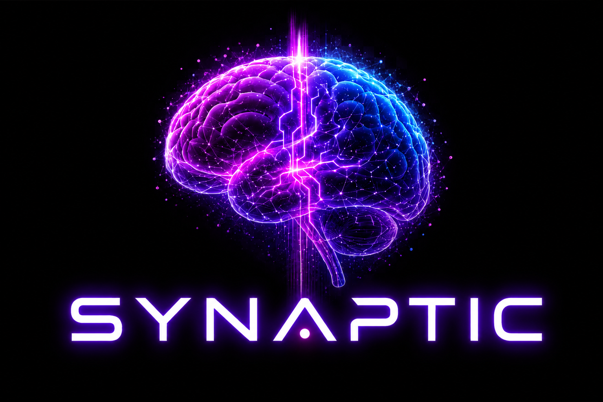

<p align="center">
  
</p>

# Synaptic

**Your Obsidian vault, compiled into a thinking network.** Synaptic is a local-first intelligence layer that sits between your [Obsidian](https://obsidian.md) vault and Claude (or any LLM). It ingests your raw captures, compiles them into linked permanent notes, tags them with evidence-backed confidence scores, surfaces non-obvious connections, and answers questions grounded in everything you have ever written, without any of it leaving your machine.

The distinction that matters: **this is not RAG.** Retrieval-augmented generation re-derives an answer from raw chunks on every query and accumulates nothing. Synaptic compiles sources *once* into structured, linked pages, and answers from that built artifact. Knowledge that is compiled compounds; knowledge that is retrieved is rediscovered.

13 vault skills · 7 MCP tools · 0 required cloud calls.

> **New here, or not very technical?** Start with the [step-by-step Getting Started guide](GETTING-STARTED.md). It walks you through everything from zero in plain English, with no assumed knowledge. This README is the full reference for when you want the details.

---

## Contents

- [What Synaptic is](#what-synaptic-is)
- [Core concepts](#core-concepts)
- [How it works](#how-it-works)
- [Installation](#installation)
- [Quick start](#quick-start-three-commands-to-a-felt-result)
- [A worked example: one note, end to end](#a-worked-example-one-note-end-to-end)
- [Everyday use](#everyday-use)
- [Running a local model (Ollama)](#running-a-local-model-ollama)
- [Using Synaptic from Claude Code or Codex](#using-synaptic-from-claude-code-or-codex)
- [Configuration](#configuration)
- [Personal vs. shared vaults](#personal-vs-shared-vaults)
- [Vault structure (PARA)](#vault-structure-para)
- [The intelligence file: CLAUDE.md](#the-intelligence-file-claudemd)
- [Skills](#skills)
- [CLI reference](#cli-reference)
- [Optional integrations](#optional-integrations)
- [Project layout & development](#project-layout--development)
- [Roadmap](#roadmap)

---

## What Synaptic is

Most note systems fail at the same point. Capturing is easy, filing feels productive, and then the note sinks to the bottom of a pile you never scroll through again. You end up as the search engine: the only process that ever runs across the whole vault is you, by hand, on the rare day you remember a note exists. The vault grows every week while its value flatlines.

Synaptic inverts that. Your notes stop being something only you can read and become something an agent reads, writes, links, and pulls from on demand. You curate sources and ask questions; the system does the bookkeeping: summarizing, cross-referencing, filing under the right idea, and updating neighbors when something new arrives.

Three properties define it:

- **Local-first.** The default model is [Ollama](https://ollama.com) running on your own hardware, and `local_only: true` ships on. Your half-formed thoughts, private strategy, and sensitive captures stay on the machine until you explicitly opt in. If Ollama is not installed, Synaptic falls back to a deterministic heuristic engine so every command still works; it simply gets smarter once a model is available.
- **Evidence over hallucination.** Every AI-suggested tag carries a confidence score, the source it came from, the quoted evidence that justified it, and a privacy-safety flag. Nothing becomes canonical without your approval.
- **Plain text you own.** The vault is ordinary Markdown files in ordinary folders. No proprietary database, no lock-in. Point a different model at the folder next year and it still works, because you own the brain, not the tool.

It is built for one person's second brain by default, and can be set up as a shared team brain (see [Personal vs. shared vaults](#personal-vs-shared-vaults)). It is agent-agnostic: it pairs naturally with Claude Code or Codex through an [MCP server](#using-synaptic-from-claude-code-or-codex), so the agent can query your vault directly as a tool instead of you copy-pasting note content.

## Core concepts

A short glossary. These terms recur throughout the docs and skills.

| Term | Meaning |
|------|---------|
| **PARA** | The folder taxonomy: **P**rojects, **A**reas, **R**esources, **A**rchive, plus an Inbox and a System folder. Organized for *retrieval* (what you'll know when you look for a note) rather than *storage* (where it came from). |
| **Capture** | A raw, unprocessed thought or highlight dropped into `00 - INBOX/`. Not yet a real note. |
| **Source note** | A capture rewritten in your own words and filed in `01 - NOTES/` (daily, meeting, book, course). Immutable once filed: it is the raw record. |
| **Permanent / evergreen note** | An atomic, own-words, *linked* note expressing one idea, filed in `04 - RESOURCES/topics/`. This is the compiled artifact, what the vault answers from. Each has a **Key Tension**: an explicit statement of what makes the idea non-obvious. |
| **MOC (Map of Content)** | An index note that links to every note on a topic. Lets the agent (and you) navigate a topic cluster in one hop. Lives in `06 - SYSTEM/MOCs/`. |
| **Entity** | How a note appears in Synaptic's local database after a scan, with its type, frontmatter, body, and wikilinks parsed out. |
| **Topic note** | A special note (`type: topic`) that *defines a tag* in plain English plus matching rules. The tagging engine scores every other note against every topic note. |
| **Evidence-backed tag** | A tag suggestion carrying a confidence score, source reference, quoted evidence, and a privacy-safe flag. It sits in a pending queue until you approve it. |
| **Contribution** | A logged record that a note fed into a real output (an article, a decision, a brief). The metric that matters is not how many notes you have, but how many times notes *contributed* to something. |
| **The three layers** | `01 - NOTES/` (raw, immutable, yours), then `04 - RESOURCES/topics/` (the wiki, compiled, the model's to maintain), then `06 - SYSTEM/CLAUDE.md` (the schema and rules, shared). Keeping them separate is what makes the system trustworthy. |

## How it works

### The pipeline

A note travels through a fixed pipeline. Each CLI command is one stage:

```
     capture              scan               embed              suggest-tags -> review -> write-tags
  (drop a note   ->   parse vault into  ->   compute vector  ->   score every note against every
   in 00-INBOX)       the local SQLite       embeddings for       topic note; queue evidence-backed
                      DB as entities         semantic search      suggestions; you approve; approved
                                                                  tags written back to frontmatter
                          |                        |                         |
                          +------------------------+-------------------------+
                                                   v
                                    query / brief / find_connections
                              (answer questions, generate briefs, surface links,
                               all grounded in the compiled, tagged vault)
```

- **`scan`** reads every Markdown file, splits frontmatter from body, extracts wikilinks and sections, and upserts each note as an *entity* into a local SQLite database (`.synaptic/synaptic.db`). Nothing is sent anywhere.
- **`embed`** turns each note into a vector using a local embedding model (`nomic-embed-text` via Ollama) and stores it. This powers semantic search ("find notes that *mean* something similar"). Without embeddings, Synaptic falls back to keyword search.
- **`suggest-tags`, `review`, `write-tags`** are the tagging loop, described below.
- **`query`, `brief`, `find_connections`** are the read side; they consume the compiled, tagged vault.

A **file watcher** (`synaptic watch`) can re-run the scan automatically whenever a file changes, so the database stays current as you write.

### How a question gets answered

`synaptic query "…"` (and the `query_vault` MCP tool) resolve an answer through a cascade designed to reach the right notes cheaply before falling back to broader search:

1. **MOC-first.** If a Map of Content's filename is a *strong* topic match for the question (two or more shared meaningful words, or a single-word topical MOC whose word the question contains), Synaptic answers from that MOC and the notes it links. This is the "navigate by index, don't brute-force the corpus" path. Generic index names and incidental word overlaps deliberately don't trigger it.
2. **Frontmatter-narrowed semantic search.** Otherwise, Synaptic narrows candidates by matching the question's meaningful words against each note's tags/type/project, cutting hundreds of notes down to a handful, then ranks that set by embedding similarity (cosine, above a relevance threshold).
3. **Keyword fallback.** If embeddings aren't available or return nothing, it runs a term-frequency keyword search (with a title-match boost) over the same candidate set.
4. **Full-vault retry.** If narrowing found nothing, it re-runs the search against the whole vault, so a too-aggressive narrow can never hide an answer.
5. **Synthesis.** The gathered notes become context for an LLM that answers *using only those notes and citing them by title*. With no LLM available, it returns the ranked list of the most relevant note titles instead.

### How tagging works

Tags in Synaptic are *earned*, not sprinkled. You define a tag by writing a **topic note** (`type: topic`) that describes the tag in plain English plus optional matching rules. Then:

1. **`suggest-tags`** scores every note against every topic note. If a real model is routed to the `tagging` task it uses it for nuanced judgment; otherwise a deterministic keyword matcher runs so the feature always works. Each match becomes a suggestion carrying a **confidence score**, the **quoted evidence** that justified it, and a **privacy-safe flag**. Suggestions below the confidence floor (default `0.55`) are dropped.
2. **`review`** walks you through pending suggestions one at a time, showing the evidence, so you approve or reject each. It also surfaces *rejection patterns*: if you keep rejecting the same tag, it proposes adding that to the "not useful" section of your `CLAUDE.md`, so the vault sharpens from your corrections rather than requiring you to write rules up front.
3. **`write-tags`** injects only the approved tags back into each note's frontmatter.

Nothing becomes canonical without human approval. The whole loop is built around evidence and consent.

### How privacy works

Every note carries a `privacy` level (set in frontmatter, or auto-classified). A privacy classifier flags likely-sensitive content and redacts it before anything is generated. The level gates what may appear in briefs and recommendations:

| Level | Appears in briefs / recommendations? |
|-------|--------------------------------------|
| `public` | Yes, everywhere |
| `professional` | Yes |
| `personal_sensitive` | Only if explicitly allow-listed |
| `nsfw` | Never |
| `excluded` | Never indexed or used at all |

Combined with `local_only: true`, this means sensitive thinking stays both on your machine *and* out of any generated output unless you deliberately permit it.

### Local-first, provider-agnostic routing

Synaptic routes work per task. By default every task (tagging, embeddings, briefs, strategic queries) goes to local Ollama, and the `privacy_filter` task always runs locally regardless of anything else. You can point individual tasks at a hosted provider (OpenAI, Anthropic, xAI/Grok, DeepSeek, OpenRouter, or any OpenAI-compatible endpoint) by adding a key to `.env` and setting `local_only: false`. For example, tag locally but synthesize briefs with a stronger paid model. Synaptic warns once per session before any external call.

## Installation

```bash
# Clone, then from the project root:
python -m venv .venv
. .venv/Scripts/activate           # Windows
# source .venv/bin/activate         # macOS / Linux

pip install -e .                    # core
pip install -e ".[mcp]"             # + Claude Code MCP server
pip install -e ".[dev,mcp]"         # + test/dev tooling
```

Requirements: Python 3.10+. Ollama is optional but recommended; without it, Synaptic uses a heuristic fallback.

## Quick start: three commands to a felt result

Don't read the architecture first. Drop one real note in, ask it back a question, see it work. Everything else is here when you want it, not before.

```bash
synaptic init                                          # create PARA folders, CLAUDE.md, config.yaml
# drop one real note (a thought, a highlight, anything) into 00 - INBOX/
synaptic scan                                          # parse the vault into the local DB
synaptic query "what's in my vault?"                   # ask it back
```

That's the loop: **capture, scan, ask.** It works with zero Ollama setup, because everything falls back to a deterministic heuristic engine, so the loop never blocks on infrastructure. It gets sharper once a model is running, but never requires one to start.

`init` asks one branching question up front: **personal brain or shared team brain?** Personal is the default. See [Personal vs. shared vaults](#personal-vs-shared-vaults).

Prefer to explore without creating anything? Use the bundled example vault instead of `init`:

```bash
cp config/config.example.yaml config/config.yaml   # already points at examples/vault
synaptic scan && synaptic query "what do I know about deliberate practice?"
```

Once the loop feels real, the fuller cycle:

```bash
synaptic doctor           # check Ollama / models / config
synaptic health           # inbox size, unlinked notes, missing frontmatter
synaptic embed            # compute semantic embeddings (needs nomic-embed-text)
synaptic suggest-tags     # generate pending, evidence-backed tag suggestions
synaptic review           # approve / reject, and surface rejection patterns for CLAUDE.md
synaptic write-tags       # inject approved tags back into note frontmatter
synaptic brief "Jane Doe" # privacy-safe contact brief
synaptic contributed "Note Title" --context "used in Q2 article"   # log a contribution
synaptic contribution-report   # which notes have earned their keep vs. sat unused
synaptic mcp              # start the MCP server for Claude Code
```

## A worked example: one note, end to end

Say you just read a chapter of *Peak* and jotted a rough thought.

1. **Capture.** You drop a scrap into `00 - INBOX/`:
   ```
   IDEA: practice only helps if you get feedback on your mistakes
   CONNECTS TO: the 10,000 hours idea, but that misses something
   ```

2. **Process it into a permanent note.** Using the `capture-processor` and `permanent-note` skills (or by hand), the scrap becomes an atomic, own-words note in `04 - RESOURCES/topics/`:
   ```markdown
   ---
   type: resource
   status: draft
   date: 2026-05-14
   description: Deliberate practice requires immediate feedback on errors, not just repetition.
   tags: [learning, expertise]
   source: Peak (Ericsson & Pool)
   ---

   # Deliberate Practice Requires Immediate Feedback on Errors

   Improvement requires not just repetition but repetition with immediate
   feedback on what went wrong. Practice without feedback optimizes for
   fluency, not accuracy…

   ## Key Tension
   This contradicts the popular "10,000 hours" framing. The hours don't
   produce expertise; the feedback structure does…

   ## Connections
   - [[Compounding Requires Consistency More Than Magnitude]]: both are about
     the quality of the input loop, not the volume
   ```
   The raw scrap stays in `01 - NOTES/` or the archive as the immutable source; the permanent note is the compiled artifact.

3. **Scan & embed.** `synaptic scan` loads the note as an entity; `synaptic embed` gives it a vector.

4. **Tag.** `synaptic suggest-tags` scores it against your topic notes and proposes, say, `#deliberate-practice` at 0.88 confidence with the quoted sentence as evidence. `synaptic review` shows you that; you approve; `synaptic write-tags` writes it into the frontmatter.

5. **Compound.** Weeks later you ask `synaptic query "does practice volume actually matter?"`. Synaptic narrows to the learning and expertise notes, ranks by meaning, and answers *from your own note*, cites it, and surfaces the Key Tension you wrote. When that answer feeds an article, you run `synaptic contributed "Deliberate Practice Requires Immediate Feedback on Errors" --context "Q2 essay on skill-building"`, and the note graduates toward `status: reference`.

That is the whole point. The note didn't just get stored, it got *used*, and it will surface itself the next time it's relevant.

## Everyday use

**Daily (a few minutes).** Capture freely into `00 - INBOX/` with no sorting in the moment. Once a day, process the inbox: rewrite each keeper in your own words, link it to at least one existing note, and file it. The `capture-processor` skill drives this. The golden rule is *never file a raw capture, and never leave a note with zero links*.

**Ingesting a source (one at a time).** When you read something worth absorbing, use the `karpathy-ingest` skill: file the source note immutably, then run a **Neighbor Update**, which finds every existing permanent note the new source confirms, contradicts, or extends, and updates those. One source, fully integrated, before the next. Batch-importing produces a pile; ingesting one at a time produces a wiki.

**Weekly (~45 minutes).** Run the `weekly-ritual`: clear the inbox, surface new connections among the week's notes, audit for orphans (`synaptic health` shows zero-link notes), and write a short review. You can schedule the mechanical parts to run unattended (see the skill for cron and Task Scheduler recipes), but grant a scheduled job archive access only, never delete.

**Checking the vault's health.** `synaptic health` reports inbox size, unlinked and orphan notes, and missing frontmatter. `synaptic contribution-report` shows which notes have earned their keep versus which have sat unused. The unused ones are candidates for the archive.

## Running a local model (Ollama)

`synaptic doctor` detects whether Ollama is reachable on `http://localhost:11434` and which models exist.

```bash
# Native install: https://ollama.com/download   (or `winget install Ollama.Ollama`)
# ...or via Docker:  docker compose up -d ollama

ollama pull llama3.2:3b        # fast, good for 8 GB RAM
ollama pull llama3.1:8b        # smarter, needs 16 GB RAM
ollama pull nomic-embed-text   # embeddings (required for semantic search)
```

Model selection by task:

- **Daily vault work / capture processing:** `llama3.2:3b` (8 GB) or `llama3.1:8b` (16 GB)
- **Long-document analysis, note synthesis:** `gemma2:9b` (24 GB)
- **Creative writing, idea development:** `mistral:7b`
- **Constrained hardware:** `llama3.2:1b` or `phi3:mini`

Prefer a hosted model for some tasks? Put a key in `.env`, set `local_only: false`, and point the relevant `routing:` entry at that provider.

## Using Synaptic from Claude Code or Codex

Synaptic is agent-agnostic. You can drive it from Claude Code, Codex, or any coding agent in three ways, and they compose:

1. **As a CLI.** `synaptic scan`, `synaptic query "…"`, and the rest are ordinary shell commands. Any agent with a terminal (Claude Code's Bash tool, Codex's shell) can run them directly. Nothing here is Claude-specific.
2. **As an MCP server.** `synaptic mcp` starts a standard stdio [MCP](https://modelcontextprotocol.io) server exposing the 7 tools below, so the agent queries your vault as native tools with no copy-pasting. Requires `pip install "synaptic[mcp]"`.
3. **As skills.** The `skills/` folder is plain Markdown playbooks an agent can read and follow; the bundled `kepano/obsidian-skills` target the open Agent Skills spec that runs on Claude, Codex, and others.

**Claude Code** reads MCP servers from `.claude/settings.json`. Register it once:

```json
{
  "mcpServers": {
    "synaptic": {
      "command": "synaptic",
      "args": ["mcp"],
      "cwd": "/path/to/your/vault-project"
    }
  }
}
```

**Codex** reads MCP servers from `~/.codex/config.toml`. The server command is identical; only the client's config file and format differ:

```toml
[mcp_servers.synaptic]
command = "synaptic"
args = ["mcp"]
# run the server in your vault project so it finds config.yaml:
cwd = "/path/to/your/vault-project"
```

Either way, the server exposes the same **7 tools**:

| Tool | What the agent can do with it |
|------|-------------------------------|
| `get_active_context` | Read the vault's `CLAUDE.md` (who you are, what's active) |
| `search_vault` | Semantic + keyword search, returns notes with excerpts |
| `get_note` | Fetch a full note by title |
| `query_vault` | Ask a question; answered from the vault with citations (the cascade above) |
| `find_connections` | Find notes most connected to a given note |
| `vault_health` | Inbox size, archive count, total notes |
| `list_notes` | List notes filtered by type/status, each with its one-line `description` |

Two things worth knowing:

- **Synaptic's own model is independent of the agent driving it.** Its LLM router defaults to local Ollama and can point at OpenAI, Anthropic, or others. Whether Claude Code or Codex is the caller, Synaptic's tagging, embeddings, and query synthesis run through the provider *you* configured (locally by default).
- **`CLAUDE.md` is a filename Synaptic reads, not a dependency on Claude.** The `get_active_context` tool loads `06 - SYSTEM/CLAUDE.md` and hands that context to whichever agent asked, Codex included. Codex won't auto-load that file as its own instructions the way it would an `AGENTS.md`, but it doesn't need to: the context reaches it through the MCP tool call.

## Configuration

- `config/config.yaml` holds the vault path, storage location, privacy rules, LLM providers, and task routing. Copy it from `config/config.example.yaml`.
- `.env` holds API keys **only**. Never committed; never written into notes.

Key settings: `privacy.local_only` (hard local-only mode), `privacy.default_level` and `privacy.brief_allowed_levels` (privacy gating), `routing.<task>` (which provider handles each task), and `tagging.min_confidence` (the suggestion floor).

## Personal vs. shared vaults

`synaptic init` asks: personal brain, or shared team brain? Both paths use the same PARA structure, skills, and CLI. Only `CLAUDE.md` and the privacy defaults differ.

| | Personal | Shared |
|---|---|---|
| CLAUDE.md shape | One person's projects, decisions, voice | Team Charter: purpose, a named champion, contributors, escalation path |
| Note attribution | None needed | `contributor:` frontmatter field on every template |
| Default privacy | `professional` (shown in briefs by default) | `personal_sensitive` + `brief_allowed_levels: [public]` (nothing reaches a brief unless explicitly marked) |
| Access control | N/A | **None.** Anyone who can open the folder can read and write everything |

Be honest about that last row: **shared mode is a set of conventions for a trusted, already-synced team folder, not a permission system.** A named champion, attribution by field rather than enforcement, and stricter defaults because multiple people's context is mixing. If a team needs real access control, that's a different kind of tool.

The champion matters more than the tooling. A shared vault with an empowered champion (someone who can add sources and fix mistakes without asking permission each time) works. One where every change needs sign-off starves for the signal it needs to become useful. See `skills/claude-md.md` for the full reasoning.

## Vault structure (PARA)

Synaptic ships a retrieval-first PARA vault in `examples/vault/`:

```
vault/
├── 00 - INBOX/          # capture queue, process daily
├── 01 - NOTES/          # time-stamped source notes (daily, meetings, books, courses); immutable
├── 02 - PROJECTS/       # active projects with a defined outcome and end date
├── 03 - AREAS/          # ongoing responsibilities with no end date
├── 04 - RESOURCES/      # reference material (topics, people, places, tools); the compiled wiki
├── 05 - ARCHIVE/        # completed and inactive notes
└── 06 - SYSTEM/         # CLAUDE.md, templates, MOCs
    ├── CLAUDE.md        # intelligence activation file, read by every workflow
    ├── templates/       # note templates for every note type
    └── MOCs/            # maps of content (topic index notes)
```

The folder you file a note in encodes *what you're doing with it*, not where it came from, so you can find it later by what you'll know about it. See `skills/vault-structure.md` for the full retrieval-first philosophy and placement logic.

## The intelligence file: CLAUDE.md

`06 - SYSTEM/CLAUDE.md` is the file that tells every workflow what "useful" means *for you specifically*. Without it, Synaptic can organize notes but can't judge whether a note is worth keeping, connecting, or surfacing. It records your active projects, current decisions, writing topics, what makes a note useful (and what doesn't), your voice, and your output goals. `synaptic init` generates it by interviewing you; every skill and the `get_active_context` MCP tool read it first. Keep it current and the whole system stays aimed at what you actually care about right now. See `skills/claude-md.md`.

## Skills

The `skills/` directory contains production-quality Obsidian intelligence skills: reusable, detailed playbooks an agent (or you) can follow.

| Skill | Purpose |
|-------|---------|
| `vault-structure` | Retrieval-first PARA architecture, naming, frontmatter, tagging, the three-layer model |
| `capture-processor` | Daily inbox processing, morning capture pass, learning accelerator, the ingest principle |
| `karpathy-ingest` | Single-source ingest: file to `01-NOTES/`, then compile into permanent notes via Neighbor Update |
| `permanent-note` | Atomic, linked, own-words notes with a Key Tension, for `04 - RESOURCES/topics/` |
| `intelligence-layer` | Decision Feeder, Writing Activator, Writing Unsticker, Output Generator |
| `connection-finder` | Weekly connection surface, cross-domain link discovery |
| `map-of-content` | MOC creation and maintenance for 10+ note topic clusters |
| `claude-md` | Generate and apply the vault's intelligence activation file (personal or shared) |
| `retrieval-organization` | Search strategy, inbox processing, weekly audit, quarterly review |
| `weekly-ritual` | ~45-minute weekly session: inbox + connections + orphan audit + review, with scheduling recipes |
| `project-completion` | Archive a finished project and extract learnings |
| `local-llm-setup` | Install Ollama or LM Studio, pick models, connect Obsidian community plugins |
| `vault-prompts` | Quick-reference cheat sheet of every prompt to copy, paste, and run |

Upstream foundational skills from [kepano/obsidian-skills](https://github.com/kepano/obsidian-skills) ship pre-loaded in `skills/obsidian-markdown/`, `skills/obsidian-bases/`, `skills/obsidian-cli/`, `skills/json-canvas/`, and `skills/defuddle/`. You don't need to install them separately.

## CLI reference

| Command | What it does |
|---------|--------------|
| `synaptic init` | Create a new PARA vault interactively (folders + CLAUDE.md + config), personal or shared. |
| `synaptic doctor` | Check config, Ollama reachability, models, and the active provider per task. |
| `synaptic scan` | Parse the vault and load entities into SQLite. |
| `synaptic health` | Vault health: inbox size, unlinked and orphan notes, missing frontmatter. |
| `synaptic embed [--force]` | Compute semantic embeddings via `nomic-embed-text`. |
| `synaptic query "<question>"` | Ask a natural-language question; answered from the vault with cited sources. `--save` writes the answer back. |
| `synaptic watch` | Re-scan affected notes when the vault changes (file watcher). |
| `synaptic suggest-tags` | Generate pending tag suggestions with confidence + evidence. |
| `synaptic review [--min-rejections N] [--auto-approve-above F]` | Approve or reject pending suggestions; surface tags rejected N+ times as a suggested CLAUDE.md edit. |
| `synaptic write-tags [--dry-run]` | Write approved tags back into each note's frontmatter. |
| `synaptic brief "<name>"` | Generate a privacy-safe contact brief. |
| `synaptic tags` | List defined topic notes and their definitions. |
| `synaptic contributed "<title>"` | Log that a note contributed to a specific output. |
| `synaptic contribution-report` | Show which notes have contributed vs. sat unused. |
| `synaptic mcp` | Start the MCP stdio server for Claude Code integration. |

Every command accepts `--root <path>` to target a project directory other than the current one.

## Optional integrations

**PixelRAG / pixelbrowse (visual web reading).** [PixelRAG](https://github.com/StarTrail-org/PixelRAG) gives Claude eyes: it screenshots any URL or PDF as tiled images so charts, tables, and layouts are readable rather than lost to text extraction. Use it alongside Synaptic, so Synaptic handles your text notes and pixelbrowse handles visual document content. Clone it wherever you keep tools, then launch Claude Code with the plugin active:

```bash
claude --plugin-dir /path/to/PixelRAG/plugin
```

It works fully locally, with no backend beyond Chromium (via Playwright).

**LM Studio (alternative local runner).** [LM Studio](https://lmstudio.ai) provides a visual model browser and serves an OpenAI-compatible API at `http://localhost:1234/v1`. Uncomment the `lm_studio` provider block in `config.yaml` to use it instead of Ollama. It is handy for discovering and testing models; Ollama is lighter for daily background operation.

## Project layout & development

```
synaptic/
  config.py          # load config + .env, provider resolution, local-only enforcement
  obsidian/          # Markdown + YAML frontmatter parser, vault loader, file watcher
  db/                # SQLite store: entities, evidence, tag suggestions, contributions, audit
  llm/               # provider abstraction (ollama / openai / anthropic / compatible) + routing + heuristic fallback
  privacy/           # privacy classification + redaction pass
  tagging/           # semantic tag engine (suggestions + evidence + approval)
  briefs/            # privacy-safe brief generator
  search.py          # semantic (cosine) + keyword (TF) search, shared tokenizer
  templates/         # canonical vault note templates (single source of truth)
  mcp/               # FastMCP stdio server (7 tools)
  cli.py             # entrypoint
config/              # config.example.yaml
examples/vault/      # ready-to-run sample Obsidian vault (PARA structure)
skills/              # Obsidian intelligence skills
tests/               # pytest: store queries, init branching, template parity, MCP retrieval
```

```bash
pip install -e ".[dev,mcp]"
pytest tests/
```

## Roadmap

1. ✅ Scaffold, config, example vault (PARA structure).
2. ✅ Obsidian parser + frontmatter + file watcher.
3. ✅ Local DB + semantic embeddings (nomic-embed-text via Ollama, cosine similarity).
4. ✅ LLM provider abstraction + Ollama + LM Studio + routing + heuristic fallback.
5. ✅ Privacy classification + redaction.
6. ✅ Tag engine with confidence/evidence + approval queue + frontmatter write-back.
7. ✅ Vault health command.
8. ✅ Natural-language query, contribution tracking, MCP server.
9. ✅ Interactive vault init with personal / shared branching.
10. 🔶 Test coverage: store, init, templates, MCP retrieval. Not yet comprehensive: the tagging engine, privacy classifier, and LLM routing remain uncovered.
11. ☐ Vector ANN index (sqlite-vec / LanceDB) for large vaults (>5k notes).
12. ☐ Vault migration tool: classify existing notes, then suggest PARA placement.

## License

MIT.
